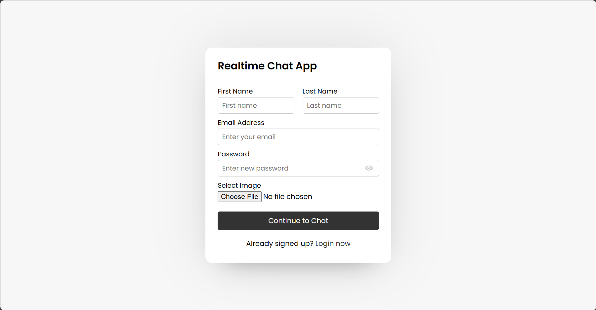
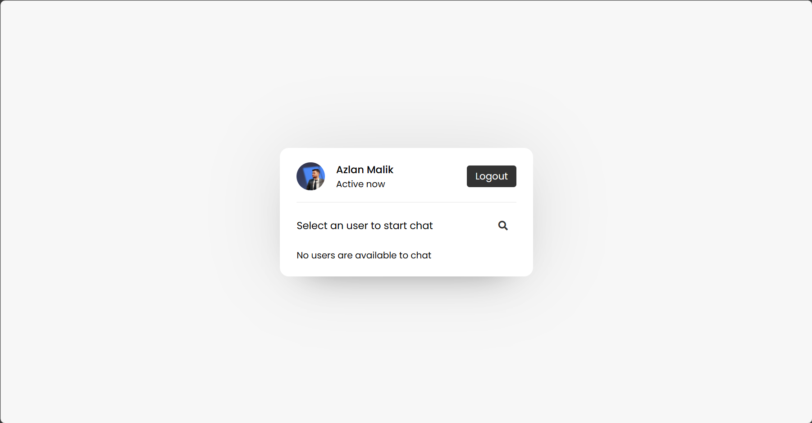
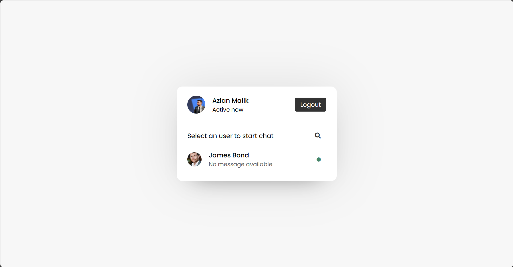
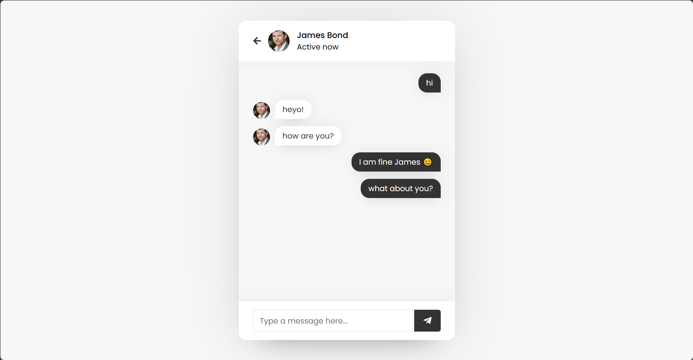

<a name="readme-top"></a>

[![Apache License 2.0][license-shield]][license-url]
[![LinkedIn][linkedin-shield]][linkedin-url]

# Realtime ChatApp

<!-- webiste images -->





# Realtime Chatting Web App
> Deployed a Realtime chat application leveraging AWS ECS for container orchestration, utilizing Terraform for Infrastructure as Code (IaC) to automate the provisioning and management of AWS resources, and incorporating DevSecOps practices for secure and efficient application deployment.


## 🚩 Table of Contents 
- [What is ChatApp](#what-is-chatapp)
- [Technology Used](#technology-used)
- [Getting Started](#getting-started)
- [Contributing](#contributing)
- [Contact](#contact)
- [Acknowledgments](#acknowledgments)
- [License](#license)


# What is ChatApp?

**ChatApp** described is a Real-time Messaging **WebApp**, a dynamic platform designed for instant communication between users. It leverages a robust technology stack, including **PHP** for server-side logic, **HTML**, **CSS**, and **JavaScript** for the frontend, ensuring a seamless and interactive user experience.


## 🎨 Features
- Automated provisioning and management of AWS resources, including ECS clusters, services, task definitions, and networking components
using Terraform.
- Integrated CircleCI for automating the build, test, and deployment processes and Leveraged Circle CI Parallel testing feature to reduce
build times and ensure faster feedback loops.
- Implemented a CI pipeline following DevSecOps practices and using multiple testing tools to analyze the bugs/errors before deploying the application to production.


# Technology Used

## Language

| Name                            |
| ------------------------------- |
| [PHP](https://www.php.net/)    |
| [MySQL](https://www.mysql.com/) |
| Javascript                      |

## DevOps Tools

| Name                                                                    | Description                                                    |
| ----------------------------------------------------------------------- | -------------------------------------------------------------- |
| [Docker](https://www.docker.com/)                                       | Used to Containerize the Application                           |
| [Terraform by HashiCorp](https://www.terraform.io/)                     | To Automate the Creation and Management of Infrastructure      |
| [Continuous Integration and Delivery - CircleCI](https://circleci.com/) | For Faster Integration and Deployment of changes to Production |
| [Serverless Compute - AWS Fargate](https://aws.amazon.com/fargate/)     | To Automatically Scale up an Scale down as needed              |
| [Container Registry -  (Amazon ECR)](https://aws.amazon.com/ecr/)       | To store the docker images in a private repository             |

## Security Tools
| Name                                                                      | Description                                            |
| ------------------------------------------------------------------------- | ------------------------------------------------------ |
| [Snyk](https://snyk.io/)                                                  | To perform SAST and Docker image Scans                 |
| [OWASP ZAP](https://www.zaproxy.org/)                                     | To perform DAST testing in production like environment |
| [Codecov - The Leading Code Coverage Solution](https://about.codecov.io/) | To check the code quality and fix errors               |


# Getting Started

## Quick Start Guide: Deploy on AWS Cloud ☁🚀

1. Clone the repo or Fork it
```sh
git clone https://github.com/AzlanMalik/ChatApp.git
```
2. Rename the `.env.example` file to `.env`
3. Add your values in the `.env` file
4. Rename `example.tfvars` file to `terraform.tfvars`
5. Add your AWS user Access Key and Secret values in the `terraform.tfvars`
6. Run these command's in cli to create the infrastructure in AWS cloud
```sh
cd /terraform/ecs
terraform apply -auto-approve
```
7. Create CircleCI account and add this project in your CircleCI account
8. Add below variables in your `CircleCI` -> `Project Settings` -> `Environmental Variables`
```
AWS_SECRET_ACCESS_KEY = <Your AWS USER SECRET KEY>
AWS_ACCESS_KEY_ID = <Your AWS USER ACCESS KEY>
APP_NAME = chatapp
ENVIRONMENT = testing
AWS_DEFAULT_REGION = us-east-1
MYSQL_HOST = db
MYSQL_USER = <WHATEVER YOU WROTE IN PROJECT .ENV FILE>
MYSQL_PASSWORD = <WHATEVER YOU WROTE IN PROJECT .ENV FILE>
MYSQL_DATABASE = <WHATEVER YOU WROTE IN PROJECT .ENV FILE>
SNYK_TOKEN = <GENERATE BY CREATING ACCOUNT ON SNYK>
```
9. Now Push changes to your GitHub Repo 
```sh
git push origin main
```
10. Approve the deployment in the `CircleCI` -> `Projects`

Congrats! Your Application is live on AWS 🧑‍🚀


## Destroy/Remove the Application From AWS 💣
```sh
terraform destroy -auto-approve
```


# Contributing

## 🔧 Pull Request Steps

ChatApp is open source, so you can create a pull request(PR) after you fix issues or add some thing cool to enhance the project. I would love to collaborate.

## Quick Start Guide: Setting Up Local on Your Computer 🚀👩‍💻

### Prerequisites 📚 

- Docker 
- Docker Compose


### Installation🔧 

1. Fork `main` branch into your personal repository. Clone it to local computer.

```sh
git clone https://github.com/{your-personal-repo}/ChatApp.git
```

2. Rename the `.env.example` file to `.env`
3. Add your values in the `.env` file
4. Run the command in cli
```sh
docker compose up
```
5. Make Cool changes in the code
6. Send Pull Request to Collaborate 🧑‍🚀

### Destroy/Remove the Application 💣
```sh
docker compose down
```


# Contact

Azlan Malik- [linkedin/azlanmalik](https://linkedin.com/in/azlanmalik) - hello@azlanmalik.tech 
Project Link: [https://github.com/azlanmalik/chatapp](https://github.com/azlanmalik/chatapp)


# Acknowledgments 

The Application Code in PHP is written by:
- [Chat Web Application using PHP with MySQL & JavaScript (codingnepalweb.com)](https://www.codingnepalweb.com/chat-web-application-using-php/)


# License

This software is licensed under the [Apache License 2.0](https://github.com/AzlanMalik/ChatApp/blob/main/LICENSE)


<!-- Variables -->
[license-shield]: https://img.shields.io/github/license/azlanmalik/static-resume-on-s3.svg?style=for-the-badge
[license-url]: https://github.com/azlanmalik/chatapp/blob/master/LICENSE.txt
[linkedin-shield]: https://img.shields.io/badge/-LinkedIn-black.svg?style=for-the-badge&logo=linkedin&colorB=555
[linkedin-url]: https://linkedin.com/in/azlanmalik